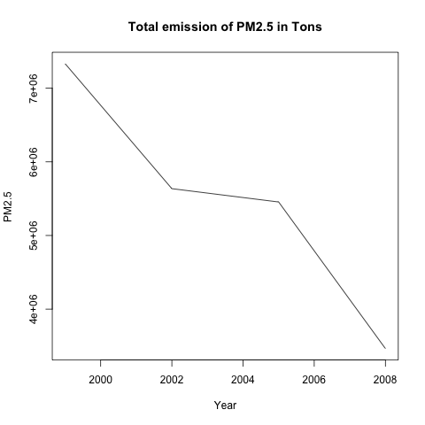
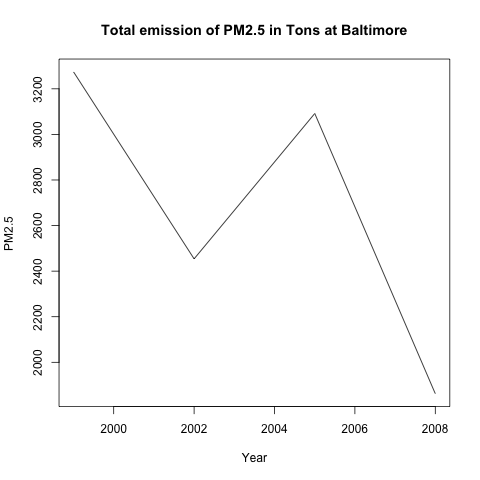
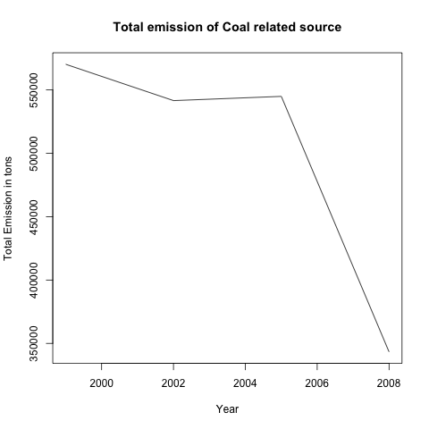
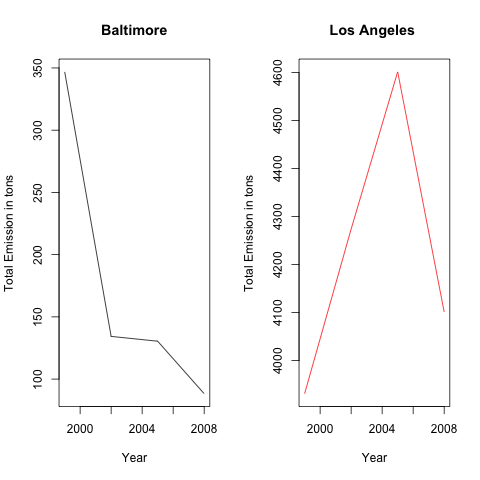

## Introduction

This is clarkne's solution to Project 2 of Exploratory Analysis on Coursera.

## Question and Answer

1. Have total emissions from PM2.5 decreased in the United States from 1999 to 2008? Using the base plotting system, make a plot showing the total PM2.5 emission from all sources for each of the years 1999, 2002, 2005, and 2008.
	*   
	*  Yes, the total emissions from PM2.5 decreased.

2. Have total emissions from PM2.5 decreased in the Baltimore City, Maryland (fips == "24510") from 1999 to 2008? Use the base plotting system to make a plot answering this question.
	*   
	*  It first decreased from 1999 to 2002, then increased from 2002 to 2005, then decreased again from 2005 to 2008.

3. Of the four types of sources indicated by the type (point, nonpoint, onroad, nonroad) variable, which of these four sources have seen decreases in emissions from 1999–2008 for Baltimore City? Which have seen increases in emissions from 1999–2008? Use the ggplot2 plotting system to make a plot answer this question.
	*   
	*  Except the "POINT" type, all the other three types had decreased in these years. The "POINT" type (in purple color) in Baltimore increased first, and then decreased. The data in 2008 for "POINT" type in Baltimore is still higher than that of 1999. 

4. Across the United States, how have emissions from coal combustion-related sources changed from 1999–2008?
	*   
	*  Generally it has a decreasing trend over the years.
	
5. How have emissions from motor vehicle sources changed from 1999–2008 in Baltimore City?
	*   
	*  It has a drastic decrease, then a moderate decrease.

	
6. Compare emissions from motor vehicle sources in Baltimore City with emissions from motor vehicle sources in Los Angeles County, California (fips == "06037"). Which city has seen greater changes over time in motor vehicle emissions?

	*   
	*  In terms of magnitute of change, Los Angeles has seen greater changes over time. 

